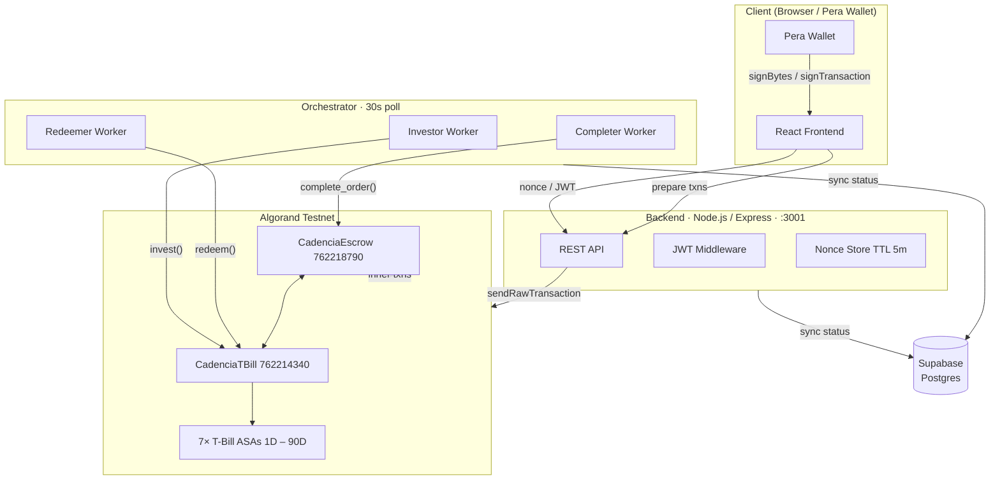
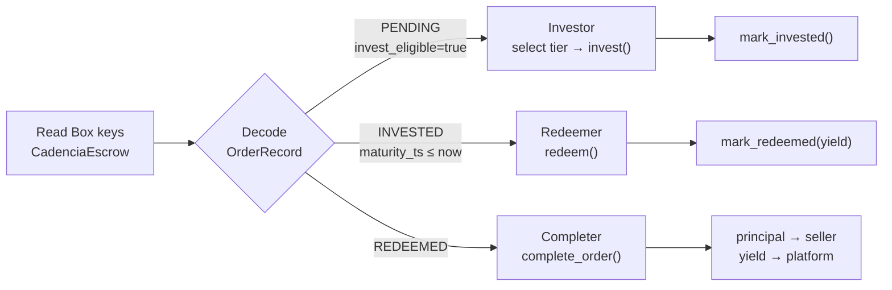
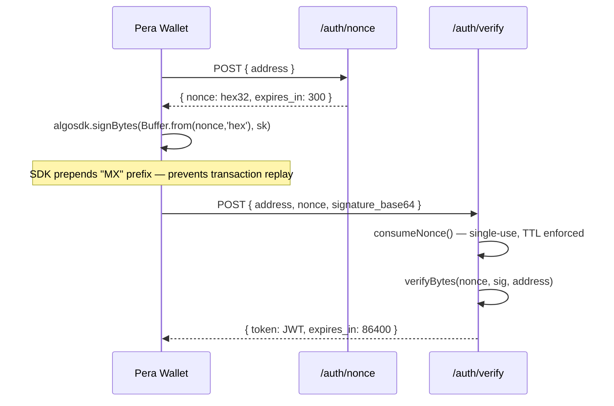
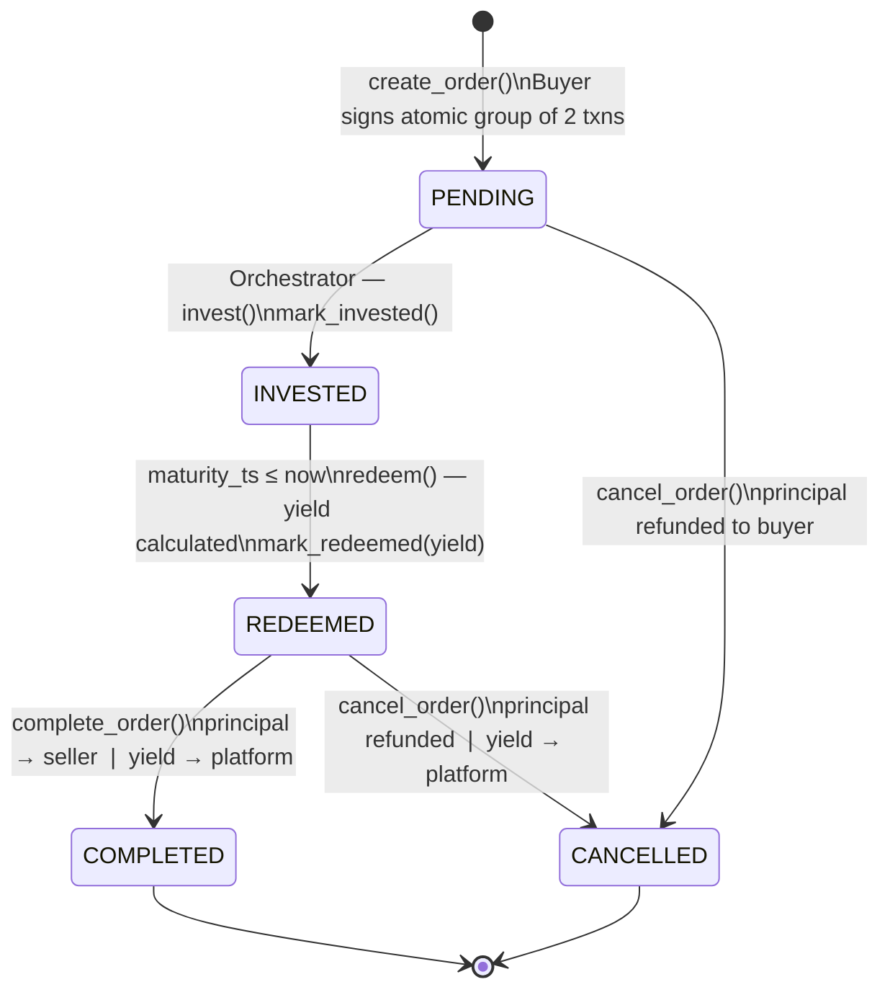

# CrestFlow Treasury

> **Non-custodial T-Bill yield engine on Algorand.** Idle escrow capital is automatically invested into tokenized short-duration T-Bills during the lock period. Sellers receive full principal; all yield flows to the platform.

[](https://testnet.explorer.perawallet.app)
[](LICENSE)
[](backend/)
[](smart_contracts/)

---

## Table of Contents

1. [Overview](#1-overview)
2. [Architecture](#2-architecture)
3. [Smart Contracts](#3-smart-contracts)
4. [Orchestrator](#4-orchestrator)
5. [Backend API](#5-backend-api)
6. [Order Lifecycle](#6-order-lifecycle)
7. [Yield Model](#7-yield-model)
8. [Project Structure](#8-project-structure)
9. [Setup & Running](#9-setup--running)
10. [API Reference](#10-api-reference)
11. [Testing](#11-testing)
12. [Deployed Contracts](#12-deployed-contracts)
13. [Admin Access](#13-admin-access)
14. [Mainnet Path](#14-mainnet-path)

---

## 1. Overview

CrestFlow is a treasury protocol that turns idle escrow ALGO into yield. When a buyer locks funds for a seller, those funds are automatically deployed into tokenized T-Bill instruments (on-chain ASAs) for the duration of the lock period. On maturity, the principal is returned to the seller and the captured yield settles to the platform wallet — entirely on-chain, without any custody of private keys.

| Property | Implementation |
|---|---|
| Non-custodial | Ed25519 nonce signing; private keys never leave the client |
| Trustless | All state transitions enforced by ARC-4 smart contracts |
| Autonomous | Orchestrator polls every 30s; zero manual intervention |
| Auditable | Every invest/redeem/complete is an indexed on-chain transaction |
| Composable | REST API exposes all operations; any frontend or marketplace can integrate |

---

## 2. Architecture



The system has three independent processes: the **React frontend** (Vite + TanStack Start), the **Express REST API** (stateless, nonce auth), and the **Node.js orchestrator** (autonomous poll loop). All on-chain interactions are signed by server-side operator keys held in `.env`; buyer keys never touch the server.

---

## 3. Smart Contracts

Both contracts are written in **AlgoPy (Puya)** and compiled to ARC-4-compliant TEAL bytecode.

### 3.1 CadenciaEscrow — `App ID 762218790`

Manages the full order lifecycle. Receives locked ALGO, tracks state in Box storage, and issues inner payment transactions on completion or cancellation.

**Box layout** — `OrderRecord` (98 bytes, keyed by `"orders" + uint64 order_id`):

```
Field             Type              Bytes    Notes
─────────────────────────────────────────────────────────
buyer             arc4.Address      0:32
seller            arc4.Address      32:64
amount            arc4.UInt64       64:72    microALGO
created_at        arc4.UInt64       72:80    Unix timestamp
lock_until        arc4.UInt64       80:88    Unix timestamp
status            arc4.UInt8        88:89    0=PENDING 1=INVESTED 2=REDEEMED
                                             3=COMPLETED 4=CANCELLED
invest_eligible   arc4.Bool         89:90    MSB-encoded (0x80 = True)
yield_earned      arc4.UInt64       90:98    microALGO
```

**ABI methods:**

| Method | Caller | Effect |
|---|---|---|
| `create_order(pay, seller, id, lock)` | Buyer | Lock ALGO, write `OrderRecord` |
| `mark_invested(order_id)` | Orchestrator | Status → `INVESTED` |
| `mark_redeemed(order_id, yield)` | Orchestrator | Status → `REDEEMED`, store yield |
| `complete_order(order_id)` | Orchestrator | Inner txns: principal → seller, yield → platform |
| `cancel_order(order_id)` | Admin | Inner txn: refund → buyer |
| `get_order(order_id)` | Any | Read raw `OrderRecord` bytes |
| `get_escrow_stats()` | Any | Aggregate counters |
| `set_tbill_app(app_id, addr)` | Admin | Link `CadenciaTBill` |
| `set_platform_wallet(addr)` | Admin | Yield destination address |
| `set_min_order(amount)` | Admin | Minimum investment threshold |

### 3.2 CadenciaTBill — `App ID 762214340`

Tokenizes T-Bill positions as on-chain ASAs. Holds ALGO reserves, tracks positions per order, and calculates yield at redemption.

**Box layout** — `TBillPosition` (26 bytes, keyed by `uint64 order_id`):

```
Field           Type            Bytes
──────────────────────────────────────
principal       arc4.UInt64     0:8     microALGO
maturity_ts     arc4.UInt64     8:16    Unix timestamp
asa_id          arc4.UInt64     16:24
status          arc4.UInt8      24:25   0=ACTIVE 1=REDEEMED
reserved        arc4.UInt8      25:26
```

**Global state:** `yield_rate_bps=500` (5% APY), `demo_mode=True`, `demo_multiplier=60`

**ABI methods:**

| Method | Caller | Effect |
|---|---|---|
| `invest(pay, order_id, tbill_asa, lock_days)` | Orchestrator | Record position, set maturity timestamp |
| `redeem(order_id)` | Orchestrator | Compute yield, return `principal + yield` ALGO to caller |
| `get_position(order_id)` | Any | Read raw `TBillPosition` bytes |
| `get_tbill_stats()` | Any | Aggregate investment counters |
| `create_tbill_asa(name, unit)` | Admin | Mint a T-Bill ASA for a tier |
| `set_yield_rate(bps)` | Admin | Update APY |
| `set_demo_mode(enabled, multiplier)` | Admin | Toggle time compression |
| `fund_reserve(pay)` | Admin | Top up the yield reserve |

---

## 4. Orchestrator

A TypeScript process running a 30-second poll loop. On each tick it reads all Box keys from `CadenciaEscrow`, decodes the `OrderRecord` structs, and dispatches to four workers.



**Tier selection** maps `lock_days` to the best-fit T-Bill ASA:

```typescript
// orchestrator/src/workers/investor.ts
function selectTier(lockDays: number) {
  if (lockDays >= 90) return TIERS['90D'];
  if (lockDays >= 60) return TIERS['60D'];
  if (lockDays >= 30) return TIERS['30D'];
  if (lockDays >= 14) return TIERS['14D'];
  if (lockDays >=  7) return TIERS['7D'];
  if (lockDays >=  3) return TIERS['3D'];
  return TIERS['1D'];
}
```

After each on-chain state transition the orchestrator also syncs the order status to Supabase so the frontend has a fast off-chain read path.

---

## 5. Backend API

Express.js REST API on port `3001`. Stateless except for an in-memory nonce store (TTL 5 minutes). Dual-auth model:

| Tier | Who | Mechanism | Token lifetime |
|---|---|---|---|
| **Web3 (Buyer/Seller)** | Any Algorand wallet | Sign 32-byte nonce with Pera → `POST /auth/verify` → JWT | 24 hours |
| **Web2 (Admin)** | Platform operator | Supabase email + password → Supabase JWT | Configurable |

### Authentication Flow



**Response masking:** Public order endpoints omit `yield_earned`, `tbill_position`, and internal position data. An admin JWT on the same endpoints returns the full payload. This is enforced server-side and cannot be bypassed from the client.

---

## 6. Order Lifecycle



### Order Creation — Atomic Transaction Group

Every new order is submitted as an **atomic group of exactly 2 transactions**. Both must succeed or the entire group reverts.

```
Txn 0 — pay
  sender:   buyer
  receiver: CadenciaEscrow address
  amount:   order_amount_µA + 3000 (flat fee buffer)

Txn 1 — appl (NoOp)
  app_id:   ESCROW_APP_ID
  method:   create_order
  args:     [seller_bytes, order_id_uint64, lock_until_uint64]
  boxes:    [{ appIndex: ESCROW_APP_ID, name: "orders" + order_id_uint64 }]
```

---

## 7. Yield Model

### Formula

```
yield_µA = principal_µA × yield_rate_bps × lock_days
           ────────────────────────────────────────────
                         3,650,000
```

### T-Bill Tiers

| Tier | Lock days | Demo maturity | ASA ID |
|---|---|---|---|
| cTBILL-1D | 1 | 60 seconds | 762214378 |
| cTBILL-3D | 3 | 3 minutes | 762214379 |
| cTBILL-7D | 7 | 7 minutes | 762214380 |
| cTBILL-14D | 14 | 14 minutes | 762214381 |
| cTBILL-30D | 30 | 30 minutes | 762214389 |
| cTBILL-60D | 60 | 60 minutes | 762214390 |
| cTBILL-90D | 90 | 90 minutes | 762214391 |

**Demo mode** is active on testnet: `maturity_seconds = lock_days × 60`. Set `demo_mode=False` for mainnet to use real calendar days.

### Example Yields (5% APY)

| Principal | Period | Yield | Total received by seller |
|---|---|---|---|
| 10 ALGO | 1 day | 0.00137 ALGO | 10.00137 |
| 10 ALGO | 7 days | 0.00959 ALGO | 10.00959 |
| 10 ALGO | 30 days | 0.04110 ALGO | 10.04110 |
| 100 ALGO | 90 days | 1.23288 ALGO | 100 (seller) + platform captures yield |

> Sellers always receive exactly the locked principal. Yield accrues entirely to the platform.

---

## 8. Project Structure

```
CrestFlow-platform/
├── .env                              # Runtime config (App IDs, mnemonics, Supabase keys)
├── .env.example                      # Template
├── requirements.txt                  # Python deps (AlgoKit, algosdk, supabase)
│
├── frontend/                         # React + Vite + TanStack Start
│   ├── src/
│   │   ├── routes/                   # File-based routing (TanStack Router)
│   │   ├── components/               # TopNav, SiteFooter, shared UI
│   │   └── lib/                      # supabase.ts, auth.tsx, format.ts
│   └── vite.config.ts
│
├── backend/                          # Express REST API
│   └── src/
│       ├── routes/                   # auth.ts · orders.ts · platform.ts · account.ts
│       ├── middleware/               # jwt.ts · adminAuth.ts
│       └── services/                 # chain.ts · nonce.ts · supabase.ts
│
├── orchestrator/                     # Autonomous investment engine
│   └── src/
│       ├── workers/                  # investor · redeemer · completer · distributor
│       ├── services/                 # escrow.ts · tbill.ts · supabase.ts · algorand.ts
│       └── services/yield-backend/   # reserve.ts (testnet) · folks-finance.ts (mainnet stub)
│
├── smart_contracts/
│   ├── cadencia_escrow/
│   │   ├── contract.py               # ARC-4 escrow contract (AlgoPy)
│   │   └── artifacts/                # Compiled TEAL + ARC-56 JSON
│   └── cadencia_tbill/
│       ├── contract.py               # ARC-4 T-Bill contract (AlgoPy)
│       └── artifacts/
│
└── scripts/
    ├── ops/
    │   ├── deploy_escrow_v2.py       # Deploy CadenciaEscrow
    │   ├── deploy_tbill_v2.py        # Deploy CadenciaTBill + mint 7 ASAs
    │   └── relink_escrow.py          # Re-link Escrow → TBill after redeploy
    └── test_full_flow.py             # ★ Primary E2E test (37 checks)
```

---

## 9. Setup & Running

### Prerequisites

| Tool | Version |
|---|---|
| Node.js | 18+ |
| Python | 3.12+ |
| AlgoKit CLI | 2.10.2+ |

### Install

```bash
git clone https://github.com/AdityaWagh19/CrestFlow.git
cd CrestFlow-platform

# Python dependencies (scripts, contract compilation)
pip install -r requirements.txt

# Backend
cd backend && npm install && cd ..

# Orchestrator
cd orchestrator && npm install && cd ..

# Frontend
cd frontend && npm install && cd ..
```

### Configure

```bash
cp .env.example .env
# Set DEPLOYER_MNEMONIC and ORCHESTRATOR_MNEMONIC
# App IDs and ASA IDs are pre-populated for the current testnet deployment

# Frontend needs its own .env
cp frontend/.env.example frontend/.env
# Set VITE_SUPABASE_URL, VITE_SUPABASE_ANON_KEY, VITE_API_URL
```

### Run (three terminals)

```bash
# Terminal 1 — Orchestrator
cd orchestrator && npx ts-node src/index.ts

# Terminal 2 — Backend API  →  http://localhost:3001
cd backend && npx tsx watch src/index.ts

# Terminal 3 — Frontend  →  http://localhost:5173
cd frontend && npm run dev
```

### Compile Contracts (only when modifying source)

```bash
algokit compile python smart_contracts/cadencia_escrow/contract.py \
  --out-dir smart_contracts/cadencia_escrow/artifacts/cadencia_escrow

algokit compile python smart_contracts/cadencia_tbill/contract.py \
  --out-dir smart_contracts/cadencia_tbill/artifacts/cadencia_tbill
```

---

## 10. API Reference

Base URL: `http://localhost:3001`
JWT-required endpoints: `Authorization: Bearer <token>`

### Auth

| Method | Path | Auth | Description |
|---|---|---|---|
| `POST` | `/auth/nonce` | — | Issue 32-byte hex nonce (TTL 5 min) |
| `POST` | `/auth/verify` | — | Verify Ed25519 signature → JWT (24h) |

### Orders

| Method | Path | Auth | Description |
|---|---|---|---|
| `GET` | `/orders` | — | List orders (`?status=&buyer=&seller=&limit=&offset=`) |
| `GET` | `/orders/estimate` | — | Yield preview (`?amount_algo=&lock_days=`) |
| `GET` | `/orders/:id` | — | Order detail + T-Bill position + lifecycle state |
| `POST` | `/orders/prepare` | JWT | Build unsigned grouped txns for client signing |
| `POST` | `/orders/submit` | JWT | Submit signed txns → confirmed txid |
| `DELETE` | `/orders/:id` | JWT | Cancel order (refund buyer) |

### Platform (Admin only)

| Method | Path | Description |
|---|---|---|
| `GET` | `/platform/stats` | Live on-chain aggregate stats |
| `GET` | `/platform/config` | Contract IDs, ASA IDs, network |
| `GET` | `/platform/tiers` | All 7 tiers with APY and demo maturity |
| `GET` | `/platform/history` | Historical platform snapshots |

### Account

| Method | Path | Description |
|---|---|---|
| `GET` | `/account/:address` | Wallet balance, assets, opted-in apps |
| `GET` | `/account/:address/orders` | Order history (`?role=buyer\|seller\|any`) |

### Misc

| Method | Path | Description |
|---|---|---|
| `GET` | `/tx/:txid` | Transaction confirmation status |
| `GET` | `/health` | Server + Algorand network health |

### Key Response Shapes

**`GET /orders/:id`**
```json
{
  "order_id": 589631,
  "buyer": "CFZR...HM4",
  "seller": "L22M...WLE",
  "amount_algo": 10,
  "status": "COMPLETED",
  "invest_eligible": true,
  "yield_earned_algo": 0.001369,
  "tbill_position": {
    "principal_algo": 10,
    "tbill_label": "cTBILL-1D",
    "maturity_iso": "2026-05-12T12:42:12Z",
    "status": "REDEEMED",
    "is_matured": true
  },
  "lifecycle": { "is_active": false, "is_complete": true },
  "links": {
    "buyer_explorer": "https://testnet.explorer.perawallet.app/address/CFZR...",
    "escrow_explorer": "https://testnet.explorer.perawallet.app/application/762218790"
  }
}
```

> **Note:** `yield_earned_algo` and `tbill_position` are omitted from unauthenticated responses. Admin JWT returns the full payload.

**`POST /orders/prepare`** body:
```json
{ "seller_address": "L22M...WLE", "amount_algo": 10, "lock_days": 7 }
```
Response: `{ order_id, unsigned_txns: [base64, base64], signing_instructions }`

---

## 11. Testing

Run against the live testnet. Backend and orchestrator must be running.

### E2E Test — `test_full_flow.py`

Exercises the complete lifecycle end-to-end: Auth → Prepare → Sign → Submit → Orchestrator invest → Redeem → Complete → Supabase sync verification.

```bash
# Fastest run — 1D tier (~5 min total including demo maturity)
python scripts/test_full_flow.py --tier 1 --amount 10

# With admin endpoint unmasking verification
python scripts/test_full_flow.py --tier 1 --amount 10 --admin-password <password>
```

**Latest verified output (37/37):**
```
STEP 1:  Backend health check         [PASS] GET /health → 200
STEP 2:  Buyer auth — nonce → JWT     [PASS] JWT issued (223 chars)
STEP 3:  Yield estimate               [PASS] 0.00137 ALGO  |  APY: 5%
STEP 4:  Prepare unsigned txns        [PASS] 2 unsigned txns returned
STEP 5:  Sign & submit                [PASS] txid confirmed on-chain
STEP 6:  Public masked view           [PASS] yield_earned / tbill_position hidden
STEP 7:  Wait for INVESTED            [PASS] Order reached INVESTED
STEP 8:  Wait for COMPLETED           [PASS] Order reached COMPLETED
STEP 9:  On-chain balance change      [PASS] Seller received ~10 ALGO
STEP 10: Admin unmasked endpoint      [PASS] Full data visible with admin JWT
STEP 11: Public mask after complete   [PASS] yield_earned still hidden
STEP 12: Unauthenticated platform     [PASS] No token → 401  |  Bad token → 401

ALL 37 CHECKS PASSED ✓
TxID: G7VHAUXXV24MU2EIKXAW2YMSWCSFPOWPHYNC6YZHLHGKOUZG7KDQ
```

---

## 12. Deployed Contracts

| Contract | App ID | Pera Explorer |
|---|---|---|
| CadenciaEscrow | `762218790` | [View](https://testnet.explorer.perawallet.app/application/762218790) |
| CadenciaTBill | `762214340` | [View](https://testnet.explorer.perawallet.app/application/762214340) |

**Test accounts (testnet):**
- Buyer: `CFZRI425PCKOE7PN3ICOQLFHXQMB2FLM45BYLEHXVLFHIQCU2NDCFKIHM4`
- Orchestrator/Seller: `L22MEYNJK47WT3WWLK2NX3PCS6SGTXZ2LHR43QRWGF2AAHTPIB46RND4GQ`

---

## 13. Admin Access

Admin routes require a **Supabase JWT** (email + password auth), separate from the Web3 wallet auth flow.

### Response masking summary

| Endpoint | Unauthenticated | Admin JWT |
|---|---|---|
| `GET /orders` | `order_id, status, buyer, seller, amount_algo, lock_until` | + `yield_earned, status_code, invest_eligible` |
| `GET /orders/:id` | Above + `lifecycle, links` | + `tbill_position, yield_earned_algo, tbill_explorer` |
| `GET /platform/*` | 401 | Full payload |

### Required env vars

```bash
ADMIN_EMAIL=your-admin@email.com
SUPABASE_URL=https://xxx.supabase.co
SUPABASE_SERVICE_ROLE_KEY=...     # backend only — never expose to client
SUPABASE_ANON_KEY=...             # safe for frontend
SUPABASE_JWT_SECRET=...           # Settings → API → JWT secret
```

---

## 14. Mainnet Path

CrestFlow is designed for a single-variable mainnet flip — no code changes required.

| Variable | Testnet | Mainnet |
|---|---|---|
| `NETWORK` | `testnet` | `mainnet` |
| `YIELD_BACKEND` | `reserve` (on-chain ALGO pool) | `folks-finance` (DeFi yield) or institutional custodian |
| `demo_mode` | `True` (1 day = 60 seconds) | `False` (real calendar days) |

The `yield-backend` interface in `orchestrator/src/services/yield-backend/` is designed to be swapped: `reserve.ts` is the current testnet implementation; `folks-finance.ts` is the mainnet Phase 2 stub, ready to be wired to [Folks Finance](https://folks.finance) liquidity pools or an institutional T-Bill custodian.

---

## License

MIT — see [LICENSE](LICENSE).
